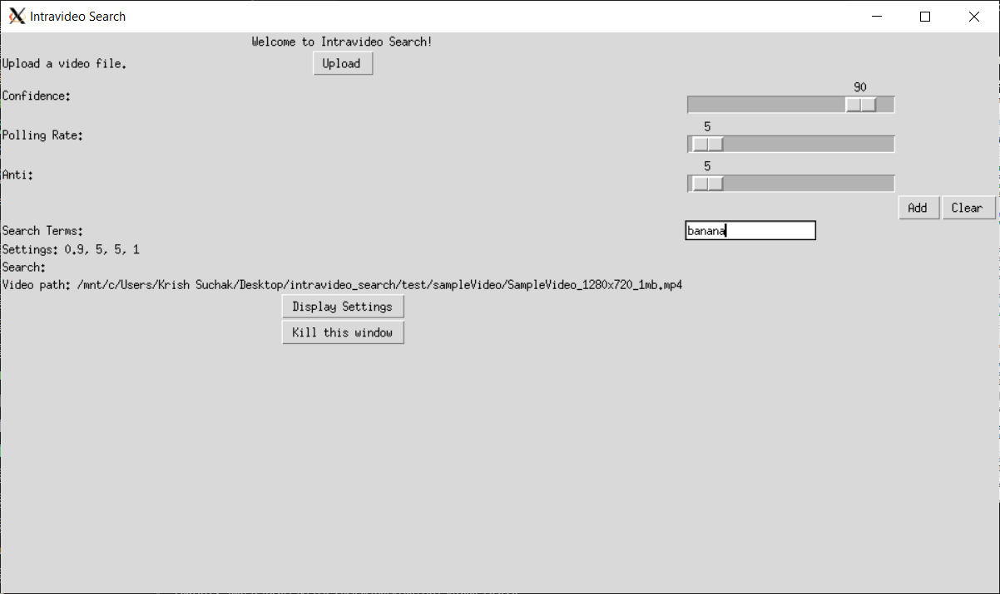
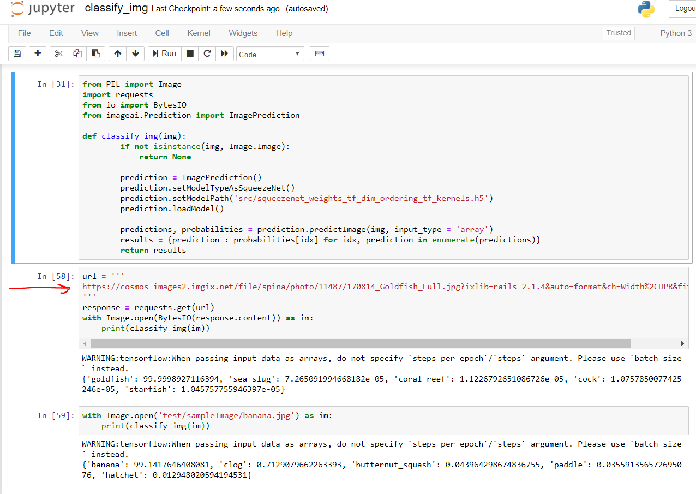

# ***IntraVideo*** **Search**
[](https://travis-ci.org/suchak1/intravideo_search)
[](https://ubuntu.com/download/desktop)
[](https://www.python.org/downloads/release/python-370/)
[](LICENSE.md)
[](https://github.com/suchak1/intravideo_search/tags)
#### a project for CMSC 22001 -- Software Construction
***
*IntraVideo Search* is a search engine that takes a video source and search terms as inputs and produces short video clips as outputs. Using ML image classification APIs, we can search through a video and retrieve only the parts relevant to the user-specified search terms.

## Getting Started

### Prerequisites

<!---Obtain a free API key.--->
Python 3.7 and a Unix-based OS or Windows Subsystem for Linux (WSL).

### Contributing

To get set up, please read the [Guide to Git](docs/GUIDE_TO_GIT.md).


### Installation

To install the necessary packages, simply run:
```
python -m pip install -r requirements.txt
```

If there is a problem installing `torch`, try this command:

```
python -m pip install torch===1.3.1 torchvision===0.4.2 -f https://download.pytorch.org/whl/torch_stable.html
```

Then, install the rest of requirements as necessary.

### New Packages

To remake the `requirements.txt` file, run:
```
pipreqs ./ --force
```

### Testing

- To run all tests, run
    ```
    PYTHON=python ./test_suite.sh
    ```
    - where `python` is your python 3 installation (might be `python3` if you have more than one installation)
- Note: to run a single test file, just append the test file path like so
    ```
    python -m pytest test/test_controller.py -vv
    ```
    and to run a single function, add the `-k` flag and the function name:
    ```
    python -m pytest test/test_controller.py -k "test_classify_img" -vv
    ```
    This might be necessary since functions like `classify_img` take a while because loading a ML model for the first time is expensive.

Note: Make sure you specify the right python version when you make these commands if you have multiple python installations, ie `python3`.

### Prettify

To maintain consistent code style, consider executing the command:

```
autopep8 -i -r ./
```

This will automatically update/rewrite all Python code in the entire repo to follow PEP8 style guidelines.

## Deployment


## Result

By running `python src/start.py`, you can start the GUI for yourself and try to add a video. Settings should update as you use the GUI.


We have also included a Jupyter notebook, so you can part of the backend dynamically.
Simply run `jupyter notebook` (make sure you have it installed, not a Python package) in the main directory and select `classify_img.ipynb` in your browser. Click Cell in the taskbar/menu and Run All. Now, note that the notebook successfully recognizes a goldfish with 99% confidence. Feel free to input/replace a URL of your choice to test object detection. 

## Files

```docs/``` - markdown files for software dev

```pics/``` - any screenshots used in markdown files

```src/``` - source code for the project

- ```model.py``` - main driver


- ```view.py``` - GUI

- ```controller.py``` - workhorse

```utils/``` - various scripts to help in dev work

- ```update.py``` - updates all packages that `pip` considers "outdated"
- ```dev_dep.py``` - lists dev dependencies (packages that aren't explicitly used in source code but you believe the project needs) - this allows the `requirements.txt` to be complete when we remake it with `pipreqs`

```.travis.yml``` - build pipeline


## License
This project is licensed under the MIT License - see the [LICENSE.md](LICENSE.md)
 file for details.

***

[](https://www.python.org/)

<!---
<<[](https://www.python.org/)>>
--->
