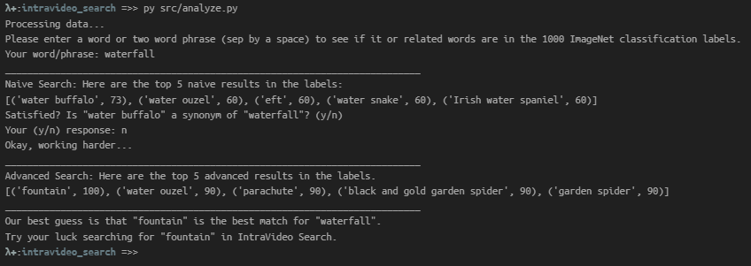
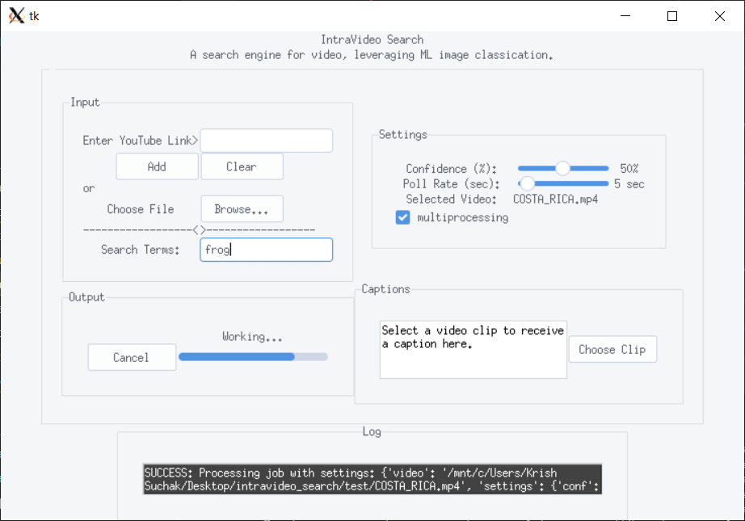

# ***IntraVideo*** **Search**
[](https://travis-ci.org/suchak1/intravideo_search)
[](https://ubuntu.com/download/desktop)
[](https://www.python.org/downloads/release/python-370/)
[](LICENSE.md)
[](https://github.com/suchak1/intravideo_search/tags)
#### a project for CMSC 22001 -- Software Construction
***
*IntraVideo Search* is a search engine that takes a video source and search terms as inputs and produces short video clips as outputs. Using ML image classification APIs, we can search through a video and retrieve only the parts relevant to the user-specified search terms.

## Getting Started

### Prerequisites

<!---Obtain a free API key.--->
These are hard requirements, and the program will not work without these.
- [x] [Anaconda (Python 3.7)](https://www.anaconda.com/distribution/)
- [x] [Linux (Ubuntu 18.04)](https://ubuntu.com/download/desktop)
- [x] an internet connection (for API calls and YouTube downloads)

Click the links above to download and install the software. If you are having trouble or would rather not, please take advantage of CSIL's Linux room. Those computers already have Ubuntu and Anaconda installed. If you are not sure whether Anaconda is installed, please ask CSIL staff for help in confirming. You can even ask them for help in making a new virtual environment (which is described in the next step).


### Contributing

To get set up, please read the [Guide to Git](docs/GUIDE_TO_GIT.md).


### Installation
If all prerequisites are met, follow these instructions to clone the repo and install the necessary Python packages. From this point on, we will assume `python` is the command for your Anaconda Python 3.7 distribution.

Here is a YouTube link to an installation guide for the repo in case you get stuck: 

https://www.youtube.com/watch?v=SulPm5PEae8&feature=youtu.be

Feel free to use the resources at CSIL as well to get started, including CSIL staff.


1. Clone the repository:
```
$ git clone https://github.com/suchak1/intravideo_search.git
```

2. Navigate into the main directory (`intravideo_search/`):
```
$ cd intravideo_search
```

3. Create a new (fresh) Python 3.7 virtual environment (called `intra` in this case) for Anaconda:
```
$ conda create -n intra python=3.7
```

4. Activate the new environment:
```
$ conda activate intra
```

   To make sure the environment switched to `intra`, you can do `conda env list` and make sure the star is on the same row as `intra`. If   not close bash, and try Step 4 again.

5. Confirm that running `python -V` yields Python 3.7. If not, make sure you specified the right Python version in Step 3 and have Anaconda for Python 3.7.

6. Install the necessary packages by running the following command:
```
$ pip install -r requirements.txt
```

   If the installation hangs for more than 10 min, cancel the command (Ctrl + C) and try again or ask staff at CSIL for help installing packages if you are at Crerar.

   If there is an error installing `torch` specifically, use this command:
   ```
   $ pip install torch===1.3.1 torchvision===0.4.2 -f https://download.pytorch.org/whl/torch_stable.html
   ```
   then install the rest of the requirements as necessary.


Note: Make sure you specify the right python version when you make these commands if you have multiple python installations, i.e. check to make sure `python -V` yields Python 3.7 otherwise your relevant command may be `python3`.


### New Packages

To remake the `requirements.txt` file, run:
```
pipreqs ./ --force
```

### Testing

- To run all tests, first make the test suite executable (bash file).
    ```
    chmod +x test_suite.sh
    ```
    Then, run
    ```
    PYTHON=python ./test_suite.sh
    ```
    - where `python` is your python 3 installation (might be `python3` if you have more than one installation)
- Note: to run a single test file, just append the test file path like so
    ```
    python -m pytest test/test_controller.py -vv
    ```
    and to run a single function, add the `-k` flag and the function name:
    ```
    python -m pytest test/test_controller.py -k "test_classify_img" -vv
    ```
    This might be necessary since functions like `classify_img` take a while because loading a ML model for the first time is expensive.

Note: Make sure you specify the right python version when you make these commands if you have multiple python installations, ie `python3`.

### Prettify

To maintain consistent code style, consider executing the command:

```
autopep8 -i -r ./
```

This will automatically update/rewrite all Python code in the entire repo to follow PEP8 style guidelines.

## Deployment


## Running and Using the Program
(Make sure you run the program and any utilities in the main dir (`intravideo_search/`).


#### Using the blackbox utility

One limitation of the application stems from using free, pretrained ML models that are only trained on 1000 objects. This means that our program only classifies objects and is specifically good at animals. We try to match your search term to the model's classification labels, but we do not always do so perfectly, or many a time 1000 objects is simply too small a sample of the English language to describe your search term. If you search for `beach`, we will also automatically search for `seashore`, `sea`, `coast`, `coastline`, etc on your behalf. However, sometimes this fails.

For example, if you search for `waterfall` in the `test/COSTA_RICA.mp4` video included in the repo, then you may not get any results. However if you search for `fountain` or `spring`, you should get multiple clips of waterfalls/fountains. To be sure, you can query the blackbox, and receive a "model-safe" word or phrase for a search term you want to use.

Run the following to get started:
```
python src/analyze.py
```

Here is the waterfall / fountain example:


Note: This feature requires an internet connection just like rest of the application.
Now, back to the main GUI application!

#### The Main Application

Run `$ python src/start.py` to begin. Then the following steps can be taken from within the GUI.

1. Select a video by:
   - entering a YouTube video URL and click `Add` to add the video to the pending Job. To clear the video from the Job, click `Clear`.
      *Note: While hypothetically you can enter any YouTube video you'd like, keep in mind that entering an extremely long video (e.g. baby shark 10 hour version) will likely take a long time to download and a long time to classify all the images. YouTube at your own risk.*
   - clicking `Browse` and choosing a local video on your hard drive.

   You will see your selected video on the right in the Settings box.

2. Enter a search term (or multiple search terms separated by commas — whitespace doesn't matter).

3. Adjust the settings by moving the sliders in the Settings box.
    - ***Confidence (%)***: Refers to the confidence score given by the ML classifier (i.e. how confident the classifier is that your searched term appears within a given image). The program will only return clips that have at least the confidence level given in the settings.

    A high confidence level will likely result in fewer false positives, but also fewer clips. A low confidence level will likely result in more false positives, but more clips.

    - ***Poll Rate (sec)***: Refers to the frequency with which the program will pull a frame to check for searched items (e.g. a poll rate of 5 seconds will check for any searched items every 5 seconds). The poll rate also determines the length of the resulting clips.

    A low poll rate will likely result in more precise clip lengths and classifications, but also longer run time. A high poll rate will likely result in less precise clip lengths and classifications, but also shorter run time.

4. To enable multiprocessing (CPU intensive concurrency), enable the multiprocessing checkmark. This will drastically speed up the Job but will also eat up CPU resources.

5. Press `Start Job` to start a Job with the specified settings and inputs (video and search terms). You can cancel at any time as the `Start Job` button will automatically become a `Cancel` button.

6. When the Job, the Log at the bottom of the window will output whether any relevant clips were found and how many. These clips will be saved in the source video's original filepath.

***Extra:***

7. Press `Choose Clip` to choose a video clip to caption. This action is available even while a Job is running.



## Acceptance tests

***Note:*** Multiprocessing/parallelized functions allow for quicker searches, otherwise the application will use slow/non-parallel versions of our functions. To speed up the processes but achieve less accurate results, increase the polling rate.

Here are 3 acceptance tests:

First, run `python src/start.py` to start GUI. Then, choose the test video in `test/COSTA_RICA.mp4` using the `Upload` button. Input each of the following scenarios, and click Start. The output should match the expected outputs below.

1. Test 1
    - **Input:**
        - *Confidence:* 30%
        - *Polling Rate:* 2 sec
        - *Anti:* 5 sec (default)
        - *Search Terms:* beach

    - **Output:**
        - 3 clips in `test/` folder all of the beach
2. Test 2
    - **Input:**
        - *Confidence:* 50%
        - *Polling Rate:* 2 sec
        - *Anti:* 5 sec (default)
        - *Search Terms:* fountain

    - **Output:**
        - 3 clips in `test/` 1st and 3rd are waterfalls, 2nd clip is beach
3. Test 3
    - **Input:**
        - *Confidence:* 80%
        - *Polling Rate:* 2 sec
        - *Anti:* 5 sec (default)
        - *Search Terms:* frog

    - **Output:**
        - 5 clips in `test/` folder first 2 are frogs, middle is komodo dragon, last 2 are snakes


## Known Functionality

The following are known functionality and not bugs.

- Log updates for most actions a user takes. For example, starting a job, saving clips (including number of videos).

- Clips save automatically to video's original source path (path at the time of starting the job).

- The progress bar does not measure actual numerical progress, only that a job is still running.

- Some search term inputs or confidence levels can yield no clips (which will be relayed on the GUI log - "No relevant clips found"). You can use the black box utility in `src/analyze.py` (explained in the section above) to use more model-friendly search terms. Also, output on your bash terminal will hint at which confidence levels the program finds your search terms - so you can adjust on the next run.

- Large video files may fill up your memory and cause the program to crash, so only videos your machine can handle are recommended. If your computer has insufficient memory, use the CSIL machines.

- To find related words (words that relate to your search terms), we use an API called Datamuse. Datamuse allows for 100,000 requests per day by a given IP address. Something to keep in mind - the program will probably stop working if you exceed this limit.

- If you cancel a job, make sure you wait for all output of your bash terminal to stop. (This may include "Broken pipes" if you cancel during the classification stage as we are trying shutdown multiple subprocessing using multiple copies of Tensorflow models all at once as gracefully as we can.) Not doing so will probably not affect classification for the next job, but may lead to memory leaks causing system instability.

- Sometimes YouTube videos will not download. The GUI will display an error message on the Log and explain that this is a network error or isssue with `pytube`. This could be an issue with a specific video or wireless connection. We would suggest trying to download at CSIL or trying a different video.

- Sometimes the clip captioner gives nonsense captions. This is a limitation of the pretrained model.

## *Extra*

We have also included a Jupyter notebook, so you can part of the backend dynamically.
Simply run `jupyter notebook` (make sure you have it installed, not a Python package) in the main directory and select `classify_img.ipynb` in your browser. Click Cell in the taskbar/menu and Run All. Now, note that the notebook successfully recognizes a goldfish with 99% confidence. Feel free to input/replace a URL of your choice to test object detection. 

## Files

```docs/``` - markdown files for software dev

```pics/``` - any screenshots used in markdown files

```src/``` - source code for the project

- ```model.py``` - main driver


- ```view.py``` - GUI

- ```controller.py``` - workhorse

```utils/``` - various scripts to help in dev work

- ```update.py``` - updates all packages that `pip` considers "outdated"
- ```dev_dep.py``` - lists dev dependencies (packages that aren't explicitly used in source code but you believe the project needs) - this allows the `requirements.txt` to be complete when we remake it with `pipreqs`

```.travis.yml``` - build pipeline


## License
This project is licensed under the MIT License - see the [LICENSE.md](LICENSE.md)
 file for details.

***

[](https://www.python.org/)

<!---
<<[](https://www.python.org/)>>
--->
